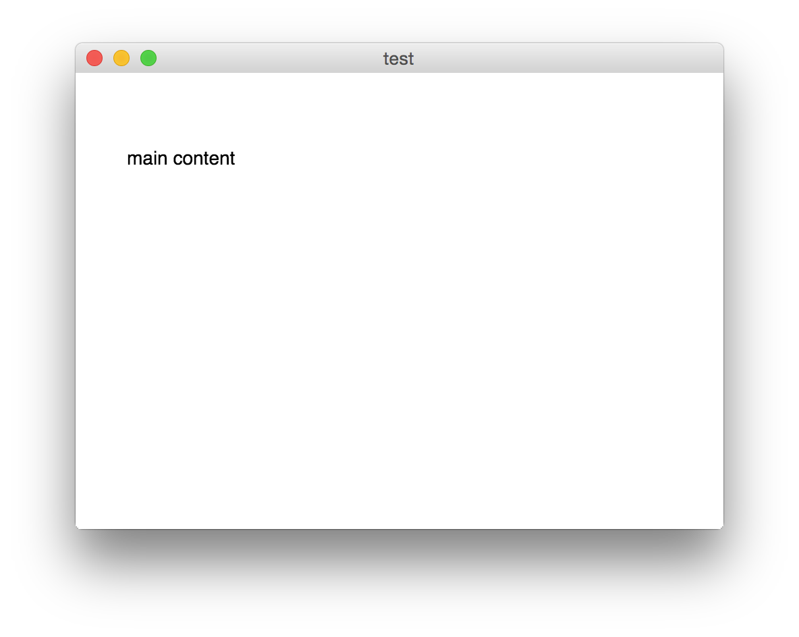

# Electron-React-Boilerplate
Electron app with React.js

# How to develop
1. `npm i` this apparently is the same as npm install (awesome!)
2. `npm start` get started you can also run gulp... works too 
3. open application in build directory... click through two levels in the window. 
4. add some react components and styles ... this is where we start guys :)
5. reload application (⌘+R) I hope this works!!

# Electron api calling
To call Electron's api, it is necessary to use window.require because, browserify rewrites require statement.

ex) `var remote = window.require( 'remote' );`
